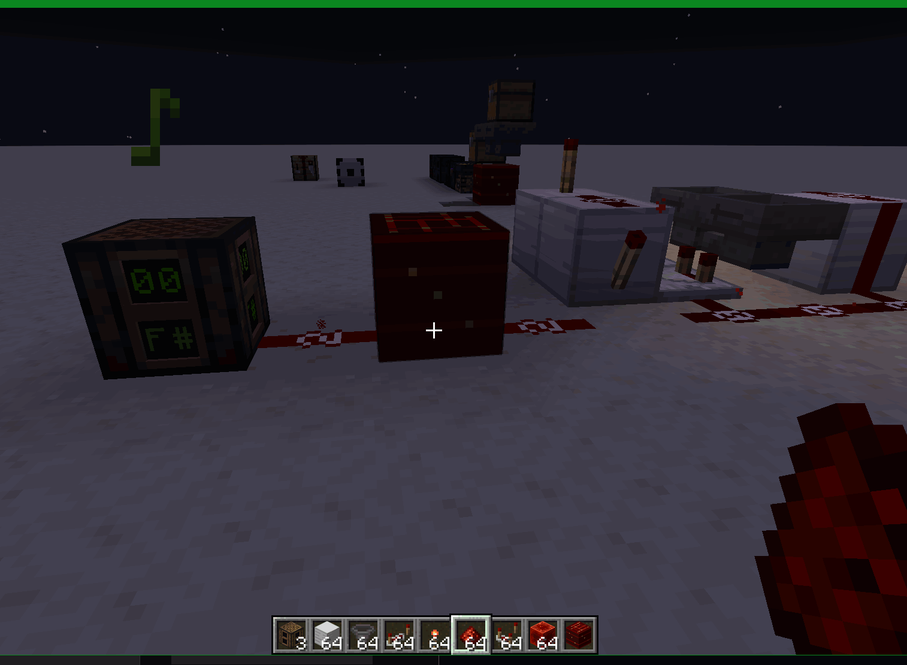

# Redstone PCBs

**A compact, save-persistent redstone board inside a single block.**

Redstone gets unwieldy fast: a working contraption covers a dozen chunks, is destroyed by any build
mistake, and nobody can hand it to a friend. Redstone PCBs puts the whole circuit on a 16×16×16 voxel
board held in one block. Build it in place, save it to your Library, and place it anywhere.

## What it does

- **PCB block** — right-click to open the board editor.
- **Real redstone** — the board's circuit is a genuine 16×16×16 region of a hidden board dimension, so
  **Minecraft itself runs the redstone**. Nothing is simulated or approximated: dust still loses 1 per
  block, repeaters still restore it, and every vanilla behaviour applies unchanged.
- **Redstone in and out** — the PCB block is both a power source and a power sink, and the level it
  carries is the real 0–15 from the world rather than a fixed 15.
- **Saved designs** — the Library panel keeps named circuits per player, stored with the world.
- **Sharing** — export a design as JSON, import one back, or push it straight into another online
  player's library.
- **Container parts** — put a furnace, blast furnace, smoker, brewing stand, crafter or hopper inside
  the board and right-click it in the editor to open its UI.
- **Item gateway** — the board exchanges items with world hoppers through the PCB block.

## The board editor

Right-click a PCB to open the editor. The board is a 16×16×16 voxel grid shown in an orthographic 3D
view.

| Input | Action |
|---|---|
| Drag | Orbit |
| `Ctrl` + drag | Pan |
| `Ctrl` + scroll | Zoom toward the cursor |
| Scroll wheel / layer buttons | Step the active layer |
| Wheel over the palette | Scroll the palette |
| Left-click | Place the selected item |
| `Shift` + left-click | Erase |
| Right-click | Use the hovered block |
| `R` | Rotate the hovered block (or the pending facing) |
| `G` | Assign a container's gateway face |
| `P` | Tap the hovered glass cell **in** (redstone) |
| `Shift` + `P` | Tap it **out** (redstone) |

View presets are two rows (NE/SE/SW/NW/Top, N/E/S/W) and **Reset** recentres the view. The active
layer is outlined, and **Pulse Layer** toggles every lever and presses every button on that layer. The
palette is a creative-style 9×3 icon grid with tabs and a search box.

The board is a real-block sandbox: any block item can be placed, not just the classic redstone set —
redstone, torch, repeater, comparator, block of redstone, lever, button, stone, glass, lamp, observer,
note block, hopper, furnace, blast furnace, smoker, brewing stand, crafter. The palette is a
**tabbed** selector (Search, Building Blocks, Redstone, Functional, Ingredients) sourced from the live
creative-tab contents. In creative every placeable item is offered; in survival only items you hold.
Placing consumes the item and removing it refunds (blocks refund their item, so redstone dust refunds
correctly). The PCB itself appears in the vanilla Redstone Blocks creative tab.

## How the board runs redstone

The circuit lives as real blocks in an empty, void world the mod registers at server start. It is
registered **in code**, never as a datapack entry, so it adds no worldgen and never triggers an
experimental-settings warning.

Boards are laid out one per chunk on a stride-2 grid, so each has a clear one-chunk border on all
sides (including diagonals). The board's own chunk is held ticking so redstone runs with no player
nearby, and the border chunks are held loaded without ticking. Breaking a board packs the region back
into the PCB item; placing it writes it back.

The dimension's height is a code parameter, so taller boards can be enabled later.

## Redstone in and out

A board has **two taps**: at most one **in** and at most one **out**, and both can exist at the same
time, so a single block can take a signal and drive one.

A tap is a **glass or tinted glass block** placed in the gap *beside* the component you want bridged —
not on it. Vanilla redstone never reads a block's own position to decide its power (a wire calls
`getBestNeighborSignal`, a lamp calls `hasNeighborSignal`, a diode reads the cell behind it), so a
component on the tap cell itself would see nothing. Beside it, it reads the tap as an ordinary
neighbour and behaves exactly as it would anywhere else.

- An **in** tap injects the level the block receives from any of its six neighbours.
- An **out** tap collects the strongest level in the board around it and offers it to the world from
  every face.

**The tap does not decay the signal** — whatever reads the tapped cell gets the full level it carries,
at any distance, exactly as a block of redstone hands out 15 to all six of its sides. That is a
property of the tap only, not a licence: from the component onward the signal is whatever vanilla does
with it, so a dust run leading away from a tap still loses 1 per block and a repeater is needed to
put the level back, exactly as in any other circuit. A tap is one full-strength source at one point,
not a lossless wire.

Press `P` on a glass cell to tap it **in**, or `Shift+P` to tap it **out** — the direction is chosen,
never inferred, so a board can be output-only, input-only, both, or neither. Press the same key again
to clear the tap, or the other one to flip it. Assigning a direction another cell already holds moves
it, and the editor names the cell that lost its tap.

Taps persist on the block, travel with the PCB item, and are carried by saved and shared designs. Item
gateways are a separate mechanism and are not affected by any of this.

## Container parts

Place a furnace, blast furnace, smoker, brewing stand, crafter or hopper inside the board and
right-click one in the editor to open its UI.

## Item gateway

The board exchanges items with world hoppers through the PCB block. The gateway is **manual**: hover
an in-board **container** (a block with inventory slots) in the editor and press `G` to assign it to a
PCB face; press `G` again to step to the next free face, and once more past the last face to clear it.

A face can be held by only one container and a container by only one face; the editor only offers faces
that are still free, so clear one before moving another container onto it. The assigned PCB face is
highlighted in the 3D view while attached. **A container with no assigned face is not reachable from
the world at all.** Non-containers cannot be assigned.

| Face | What it does |
|---|---|
| **Bottom** | An in-world hopper attached under the PCB pulls from the assigned container. |
| **Top** | The block above the PCB may be a container; the board pulls down from it. |
| **Sides** | Feed the assigned container from a hopper attached to that side. |

The PCB face only decides *whether* the container is reachable, not which of its slots accepts or
yields a transfer. Placing, clearing or rotating a cell clears its attachment (rotate it, then re-press
`G`). Items crossing the gateway also notify the in-board container, so comparators and neighbours
reading it update in the board dimension on both loaders.

Attachments persist on the block and travel with the PCB item when it is carried. This is the **item**
gateway and it is independent of the redstone taps: a board can move items, carry a signal in, or
drive one out, and the two mechanisms do not interfere.

## Saved designs

The editor's **Library** panel keeps named circuits per player, stored with the world.

A design's name is typed in the panel's name field. **Save** costs one paper in survival, and loading a
design back onto a board consumes the matching items in survival. The per-player limit is `maxDesigns`
in `config/redstonepcbs.json` (default 16), so single-player and creative worlds can raise it.

## Sharing designs

| Button | What it does |
|---|---|
| **Exp** | Exports a design as JSON to `redstonepcbs/blueprints/<name>.json` inside the game folder — so it lands in the player's own files, on a server or single-player. |
| **Import** | Reads blueprint files back from there. |
| **Share** | Pushes a saved design straight into another online player's library, stamped with your name; it appears in their list as an ordinary editable entry. |

A blueprint is a small JSON document (name + base64 grid + gateway attachments + redstone taps), so
designs can be copied between worlds and players with their porting intact; older files still import,
just without the sections they predate.

Importing is free (no paper) but still counts against the per-player limit; set `allowImport` to
`false` in the config to disable it.

## Configuration

`config/redstonepcbs.json`, shared by both loaders.

| Setting | Default | What it does |
|---|---|---|
| `maxDesigns` | `16` | Named designs one player may keep in their Library. Clamped to `1`–`4096`. |
| `allowImport` | `true` | Whether blueprint files may be imported into the Library. |

Only the server side reads the values that affect play; the client reads the file too when listing
blueprints.

## Requirements

| | |
|---|---|
| Minecraft | 1.21.1 |
| Loaders | **Fabric** (Loader + Fabric API) **or** **NeoForge 21.1.235+** |
| Java | 21 |
| Side | Client & Server |

## Installation

The jar is **universal** — the same file works on both Fabric and NeoForge (it holds the
loader-specific builds inside and each loader loads only its own copy).

Drop `redstonepcbs-<version>-universal.jar` in `mods/`. There is one mod, so there is nothing to
combine and no companion jar to install.

Install **Fabric Loader + Fabric API**, or **NeoForge 21.1.235+**, for Minecraft 1.21.1 first.

The universal jar is on CurseForge/Modrinth. If you want a single-loader build
(`redstonepcbs-<version>-fabric.jar` / `-neoforge.jar`), grab it from
[GitHub Releases](https://github.com/retiredroca/redstone-pcbs/releases).

## Compatibility

- Client & Server: install on both. The editor is client-side; the board, saved designs and gateway
  are server-side.
- Nothing about the board dimension is a datapack entry, so worlds never show an experimental-settings
  warning and there is no worldgen to disable.

## License

This project's own source code is licensed under
[Apache-2.0](https://github.com/retiredroca/redstone-pcbs/blob/main/LICENSE).

## Credits & third-party notices

- Not an official Minecraft product. Not approved by or associated with Mojang or Microsoft. Built on
  **Fabric Loader / Fabric API** (Apache-2.0) and **NeoForge** (LGPL-2.1); the official Mojang
  mappings are used for development and are not redistributed.

## Author

Retired Roca
